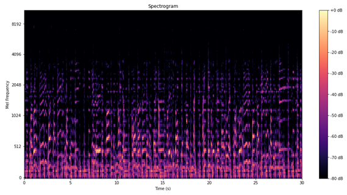
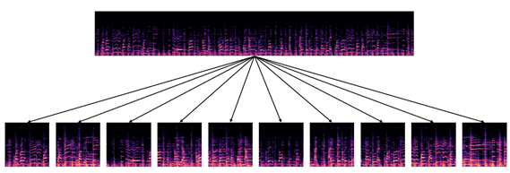
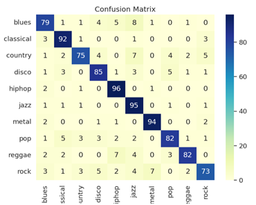

# Music-Genre-Classification Using GTZAN Dataset

[](https://hits.seeyoufarm.com)             

## 프로젝트 소개

> 본 프로젝트는 GTGAN 데이터셋을 이용해서 음악 장르 분류를 위한 CNN 모델을 구현한 프로젝트입니다.




Mel-Spectrogram은 음악의 주파수 특성을 효과적으로 시각화하는 도구로서, 이를 통해 음악 데이터를 효과적으로 분석하고 모델에 입력으로 제공합니다.

---


30초 길이의 음악 데이터를 3초 길이의 세그먼트로 나누어 학습하는 방식입니다.

---
<div align="center">
    
</div>
Accuracy는 100 Epoch 기준으로 0.88을 달성하였습니다.

---
<div align="center">
  
</div>
x축이 실제 값 y축이 예측 값의 빈도를 나타내는 Confusion Matrix입니다.

## 시작 가이드

### Requirements

For building and running the application you need:

- Docker Image(deepo)
- Python 3.8.10
- librosa 0.10.1

### Installation

- Dataset Download link: 
https://www.kaggle.com/datasets/andradaolteanu/gtzan-dataset-music-genre-classification

- ```$ git clone https://github.com/boooruim/Music-Genre-Classification.git ```

- ```$ docker pull ufoym/deepo```


## 아키텍쳐
### 디렉토리 구조
```bash
├── Genre_Classification
|   ├── README.md
|   ├── Genre_classification.ipynb
│   ├── Data # 전처리 후 train, val, test 데이터 폴더
│   │   ├── all
│   │   │   ├── blues
│   │   │   ├── classical
│   │   │   ├── country
│   │   │   ├── disco
│   │   │   ├── hiphop
│   │   │   ├── jazz
│   │   │   ├── metal
│   │   │   ├── pop
│   │   │   ├── reggae
│   │   │   └── rock
│   │   ├── test
│   │   │   ├── blues
│   │   │   ├── classical
│   │   │   ├── country
│   │   │   ├── disco
│   │   │   ├── hiphop
│   │   │   ├── jazz
│   │   │   ├── metal
│   │   │   ├── pop
│   │   │   ├── reggae
│   │   │   └── rock
│   │   ├── train
│   │   │   ├── blues
│   │   │   ├── classical
│   │   │   ├── country
│   │   │   ├── disco
│   │   │   ├── hiphop
│   │   │   ├── jazz
│   │   │   ├── metal
│   │   │   ├── pop
│   │   │   ├── reggae
│   │   │   └── rock
│   │   └── val
│   │       ├── blues
│   │       ├── classical
│   │       ├── country
│   │       ├── disco
│   │       ├── hiphop
│   │       ├── jazz
│   │       ├── metal
│   │       ├── pop
│   │       ├── reggae
│   │       └── rock
│   └── __pycache__
└── archive # GTGAN Dataset
    ├── genres_original
    │   ├── blues
    │   ├── classical
    │   ├── country
    │   ├── disco
    │   ├── hiphop
    │   ├── jazz
    │   ├── metal
    │   ├── pop
    │   ├── reggae
    │   └── rock
    └── images_original
        ├── blues
        ├── classical
        ├── country
        ├── disco
        ├── hiphop
        ├── jazz
        ├── metal
        ├── pop
        ├── reggae
        └── rock
```


