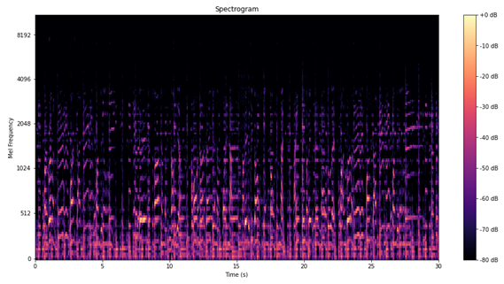
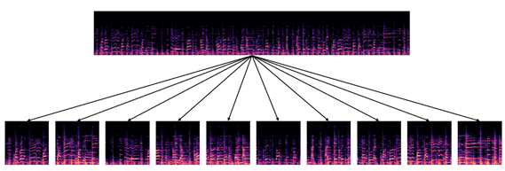
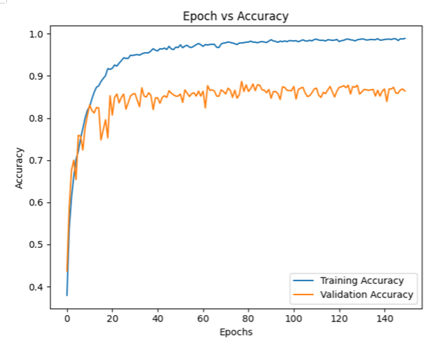
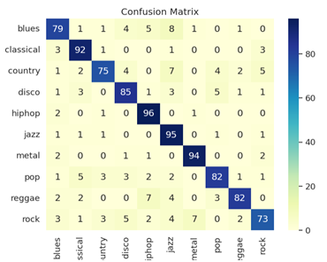
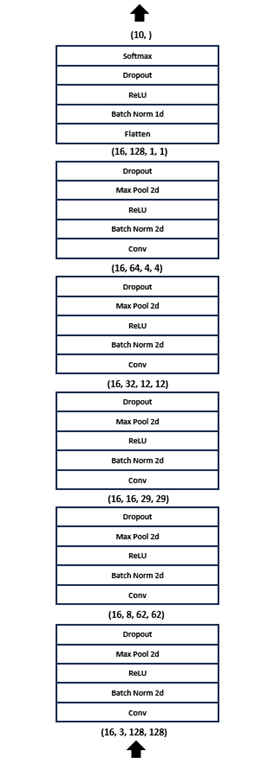

# Music-Genre-Classification Using GTZAN Dataset

[](https://hits.seeyoufarm.com)             

## Introduction

> 본 프로젝트는 GTGAN 데이터셋을 이용해서 음악 장르 분류를 위한 CNN 모델을 구현한 프로젝트입니다.

> This project is a project that implements a CNN model for classifying music genres using the GTGAN dataset.

<div align="center">
    
</div>

Mel-Spectrogram은 음악의 주파수 특성을 효과적으로 시각화하는 도구로서, 이를 통해 음악 데이터를 CNN 모델에 입력으로 제공합니다.


<div align="center">
    
</div>

모델은 30초 길이의 음악 데이터를 3초 길이의 세그먼트로 나누어 학습하는 방식입니다.

The model is a method of learning 30-second-long music data by dividing it into 3-second-long segments.

- ### Accuracy of Model
    <div align="center">
    
    </div>

    음악 장르 분류 모델의 Accuracy는 100 Epoch 기준으로 0.88을 달성하였습니다.

    Accuracy in the music genre classification model achieved 0.88 based on 100 Epoch.

- ### Cofusion Matrix

    <div align="center">
    
    </div>

    입력한 음악의 장르에 대해 x축이 실제 장르, y축이 예측 장르의 빈도를 나타내는 Confusion Matrix입니다.

    For the genre of the music you enter, the x-axis is the actual genre, and the y-axis is the confusion matrix representing the frequency of the predicted genre.

## Getting Started Guide

- ### Requirements

    For building and running the application you need:

    - Docker Image(deepo)
    - Python 3.8.10
    - librosa 0.10.1

- ### Installation

    - Dataset Download link: 
    https://www.kaggle.com/datasets/andradaolteanu/gtzan-dataset-music-genre-classification

    - ```$ git clone https://github.com/boooruim/Music-Genre-Classification.git ```

    - ```$ docker pull ufoym/deepo```

## Running the Application

- Once the image(deepo) is downloaded, run a Docker container and enter it.
- ```$ cd Music-Genre-Classification```

## Architecture
- ### CNN Structure
    <div align="center">
    
    </div>

- ### Directory Structure
    ```bash
    ├── Genre_Classification
    |   ├── README.md
    |   ├── Genre_classification.ipynb
    |   ├── images
    │   ├── Data # 전처리 후 train, val, test 데이터 폴더
    │   │   ├── all
    │   │   │   ├── blues
    │   │   │   ├── classical
    │   │   │   ├── country
    │   │   │   ├── disco
    │   │   │   ├── hiphop
    │   │   │   ├── jazz
    │   │   │   ├── metal
    │   │   │   ├── pop
    │   │   │   ├── reggae
    │   │   │   └── rock
    │   │   ├── test
    │   │   │   ├── blues
    │   │   │   ├── classical
    │   │   │   ├── country
    │   │   │   ├── disco
    │   │   │   ├── hiphop
    │   │   │   ├── jazz
    │   │   │   ├── metal
    │   │   │   ├── pop
    │   │   │   ├── reggae
    │   │   │   └── rock
    │   │   ├── train
    │   │   │   ├── blues
    │   │   │   ├── classical
    │   │   │   ├── country
    │   │   │   ├── disco
    │   │   │   ├── hiphop
    │   │   │   ├── jazz
    │   │   │   ├── metal
    │   │   │   ├── pop
    │   │   │   ├── reggae
    │   │   │   └── rock
    │   │   └── val
    │   │       ├── blues
    │   │       ├── classical
    │   │       ├── country
    │   │       ├── disco
    │   │       ├── hiphop
    │   │       ├── jazz
    │   │       ├── metal
    │   │       ├── pop
    │   │       ├── reggae
    │   │       └── rock
    │   └── __pycache__
    └── archive # GTGAN Dataset
        ├── genres_original
        │   ├── blues
        │   ├── classical
        │   ├── country
        │   ├── disco
        │   ├── hiphop
        │   ├── jazz
        │   ├── metal
        │   ├── pop
        │   ├── reggae
        │   └── rock
        └── images_original
            ├── blues
            ├── classical
            ├── country
            ├── disco
            ├── hiphop
            ├── jazz
            ├── metal
            ├── pop
            ├── reggae
            └── rock
    ```


